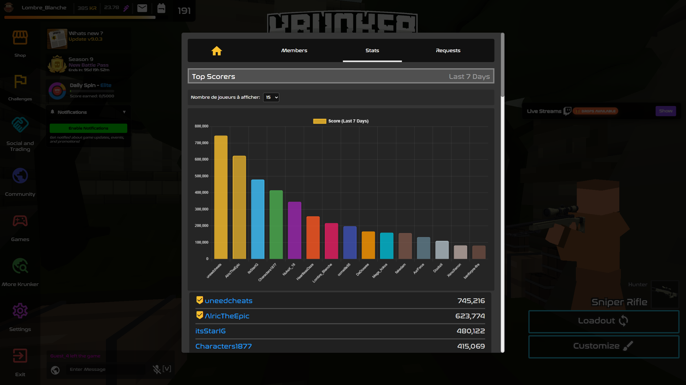

Yes its a chatGPT readme

# **Clan Score Chart for Krunker.io**

*A lightweight userscript that displays a bar chart of all clan members' scores in **Krunker.io**.*

---

## **📦 Available Scripts**

### **`clan_score_chart.js` (Default Version)**
- **Dynamic chart** that updates when switching to the clan tab.
- **Player count selector** (choose how many members to display).
- **Best for:** Visualizing clan member performance at a glance.

---

## **🎯 What Does It Do?**
- **Extracts member scores** from the clan leaderboard.
- **Displays a bar chart** showing each member's score.
- **Lets you choose** how many players to display (5, 10, 15, 20, 25, or 50).
- **Updates automatically** when switching to the clan tab.

Perfect for tracking clan activity and identifying top nerds

---

## **📊 Features**
- **Real-time score visualization** – See who’s leading in your clan.
- **Customizable player count** – Adjust how many members appear on the chart.
- **Smooth animations** – Clean transitions when updating the chart.
- **Non-intrusive design** – Fits naturally into the existing UI.
- **No performance impact** – Lightweight and efficient.

---

## **🚀 Installation**
1. **Copy the script** to your userscripts folder.
2. **Reload your Krunker client**
3. **Open the clan tab** (Tab 2) – the chart will appear automatically.

---

## **🎮 How to Use**
1. **Go to the clan tab** (Tab 2 in the profile menu).
2. **Wait a moment** – the script loads Chart.js and generates the chart.
3. **Use the dropdown** to select how many players to display.
4. **Hover over bars** to see exact scores in a tooltip.

The chart updates whenever you return to the clan tab.

---

## **📸 Preview**

The chart appears above the clan member list, showing:
- **Player names** on the X-axis.
- **Scores** on the Y-axis.
- **Color-coded bars** for easy comparison.

---

## **💡 How It Works**
1. **Waits for the DOM to load** before injecting Chart.js.
2. **Extracts clan member data** from the leaderboard (`#clanErr .settName`).
3. **Filters and sorts scores** to display the top performers.
4. **Renders a bar chart** using Chart.js with smooth animations.
5. **Updates dynamically** when switching tabs or changing the player count.

---

## **🔧 Customization**
Want to tweak the chart? Modify these in the script:
- **Colors**: Edit the `backgroundColor` array in `createScoreChart()`.
- **Max players**: Adjust the dropdown options in `createPlayerCountSelector()`.
- **Chart style**: Change `options` (e.g., `responsive`, `scales`, `animations`).

Example (changing bar colors):
```javascript
backgroundColor: [
    'rgba(255, 99, 132, 0.7)',
    'rgba(54, 162, 235, 0.7)',
    // Add more colors here...
],
```

---

## **🤝 Contributing**
- **Report bugs** (e.g., incorrect score parsing, chart errors).
- **Suggest improvements** (e.g., additional stats, better UI).
- **Fork & modify** for your own needs.
- **Discord**: Lombre_Blanche.br

---
